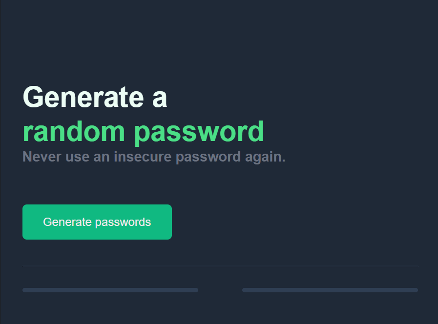
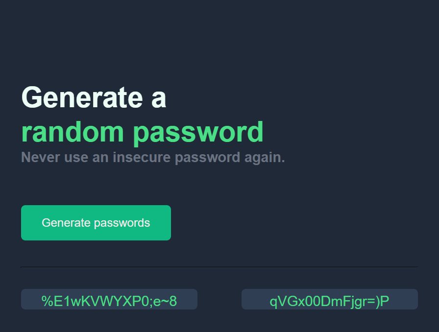
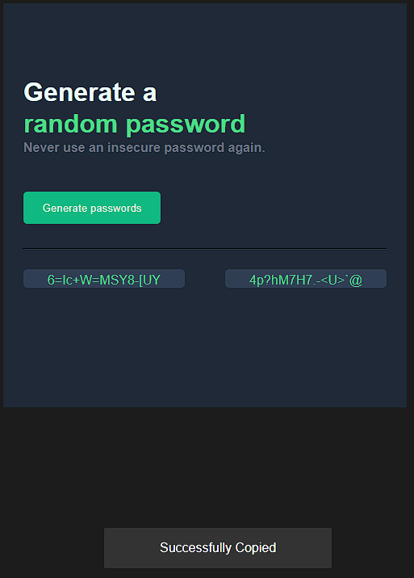

# Password Generator

A password generator app built with HTML, CSS, and JavaScript. This app allows you to generate two random passwords and includes a feature to copy them to the clipboard.

## Features

- **Generate Passwords**: Click the "Generate passwords" button to create two random passwords.
- **Copy to Clipboard**: Click on a password to copy it to your clipboard. A snackbar notification will confirm the action.
- **Responsive Design**: Styled to be visually appealing and functional across different devices.

## Technologies Used

- **HTML**: Structure of the app.
- **CSS**: Styling and layout.
- **JavaScript**: Logic for password generation and clipboard functionality.

## How to Use

1. **Open the App**: Open `index.html` in a web browser.
2. **Generate Passwords**: Click the "Generate passwords" button to produce two random passwords.
3. **Copy Password**: Click on either password to copy it to your clipboard. A snackbar will appear to confirm the successful copy.

## Files

- **`index.html`**: The main HTML file containing the structure of the app.
- **`style.css`**: The CSS file for styling the app.
- **`app.js`**: The JavaScript file responsible for generating passwords and managing clipboard operations.

## Screenshots
**Before Generating**

**After Generating**

**Copy To Clipboard Snackbar**

## How to Run Locally

1. Clone the repository:

   ```bash
   git clone https://github.com/Adlichalbi/PasswordGenerator.git
   ```
2. Navigate to the project directory:
```bash
    cd PasswordGenerator
```

3. Open `index.html` in a web browser:
Simply double-click the `index.html` file or open it using your preferred browser.

## Contributing
If you would like to contribute to this project, please fork the repository and submit a pull request. You can also open an issue to report bugs or request features.

## License
This project is licensed under the MIT License. 

## Contact
For questions or feedback, feel free to reach out to Adli Chalbi.

